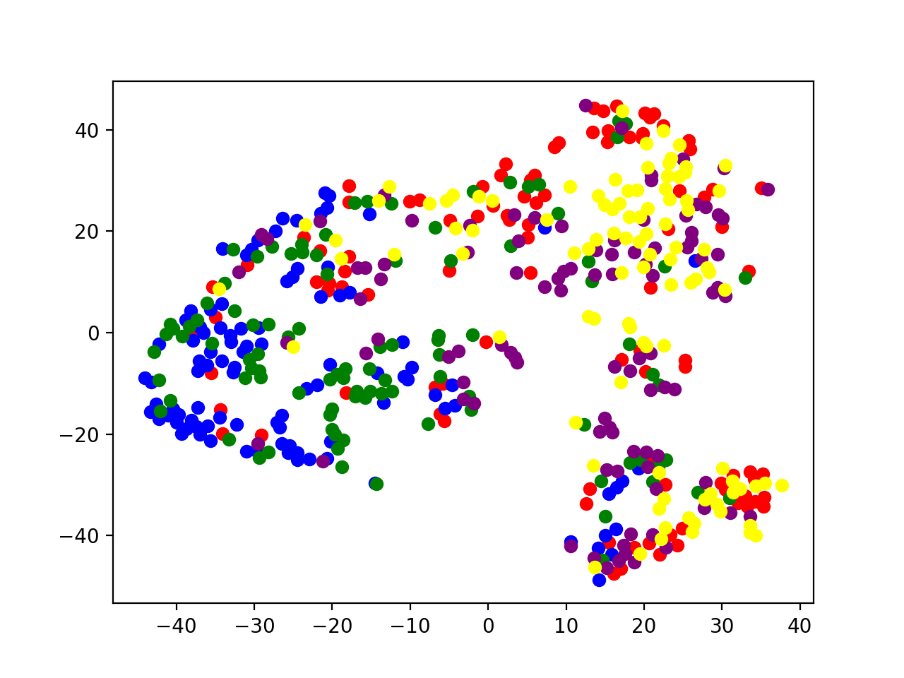

#### Initial dataset

First of all, a set of songs of different genres have been downloaded from the [MusicBrainz](www.musicbrainz.org) platform and have been added in a file [dataset.csv](./dataset.csv) with the song identifier and song genre information
Functions used: `get_dataset` and `get_dataset_ids`

#### High level features obtention

Then, the high level descriptors have been obtained through the following resource `https://acousticbrainzorg/api/v1/high-level?recording_id=x;and;z;...` for each of the song defined in the previous step (x, y and z are song id's) and stored in [dataset_features.csv](./dataset_features.csv) file

The selected high-level descriptors are the next ones:

1. Danceable: Classification of music by danceable.
2. Female gender: Classification of vocal music by gender (male / female).
3. Mood Acoustic: Classification of music by type of sound (acoustic / non-acoustic)
4. Aggressive humor: Classification of music by mood (aggressive / non-aggressive)
5. Mood electronic: Classification of music by type of sound (electronic / non-electronic)
6. Mood happy: Music ranking by mood (happy / not happy)
7. Mood party: Classification of music by mood (party/non-party)
8. Relaxed mood: Classification of music by mood (relaxed / non-relaxed)
9. Sad humor: Music classification by mood (sad / not sad)
10. Timbre: Sorting music by timbre color (dark / bright timbre)
11. Tonal: Classification of music by key (tonal / atonal)
12. Instrumental voice: Classification in music with voice / instrumental

Functions used: `get_features` and `save_dataset_features`

#### t-sne

Finally, once we have each song with n descriptors (n dimensions) we need to be able to convert it into a two-dimensional plane. In order to do this we use an implementation of t-SNE and save it to another file _dataset_tsne.csv_.

#### t-sne plot

We can see a representation in the two-dimensional plane using the `plot_tsne` function in the following figure. .
